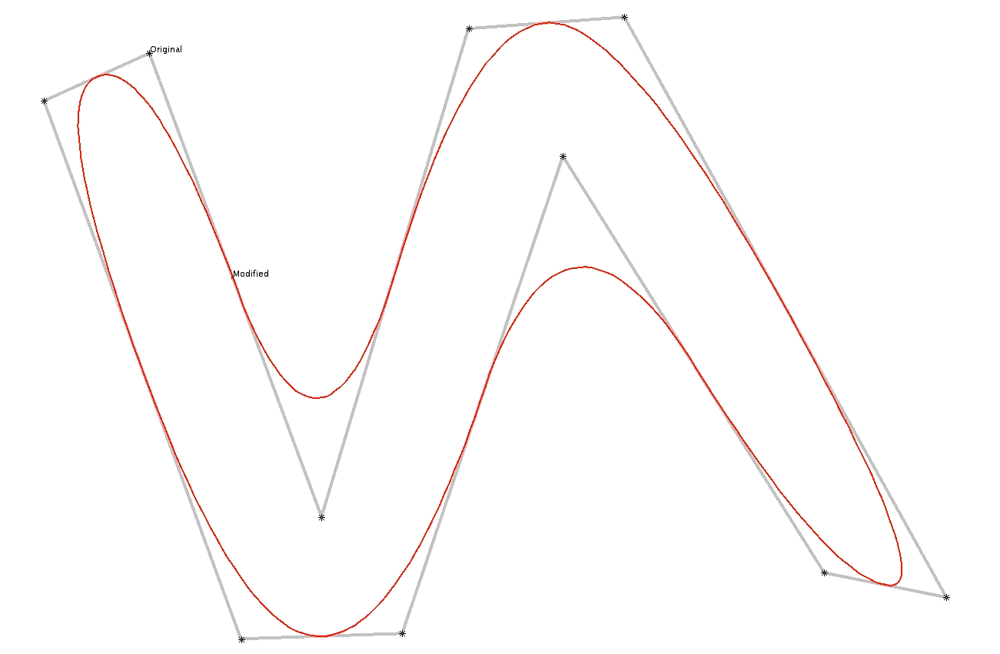
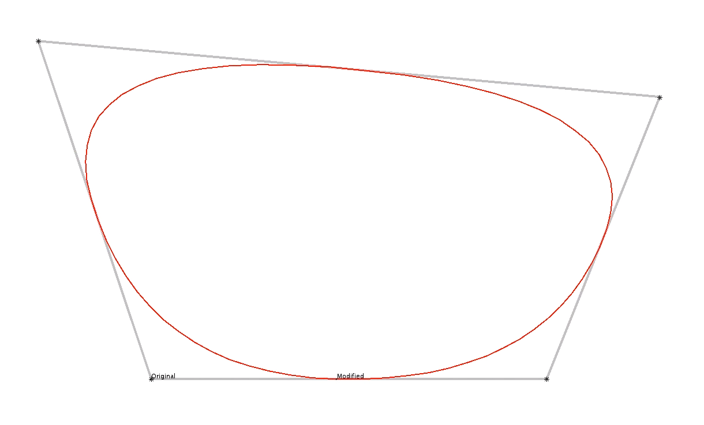

# line-smoothing
Smoothing for polylines and polygons. Implementation of George Chaikin's corner-cutting smoothing algorithm. By iterating on calls to the algorithm, more smoothness will be achieved.

## Example 1

## Example 2

